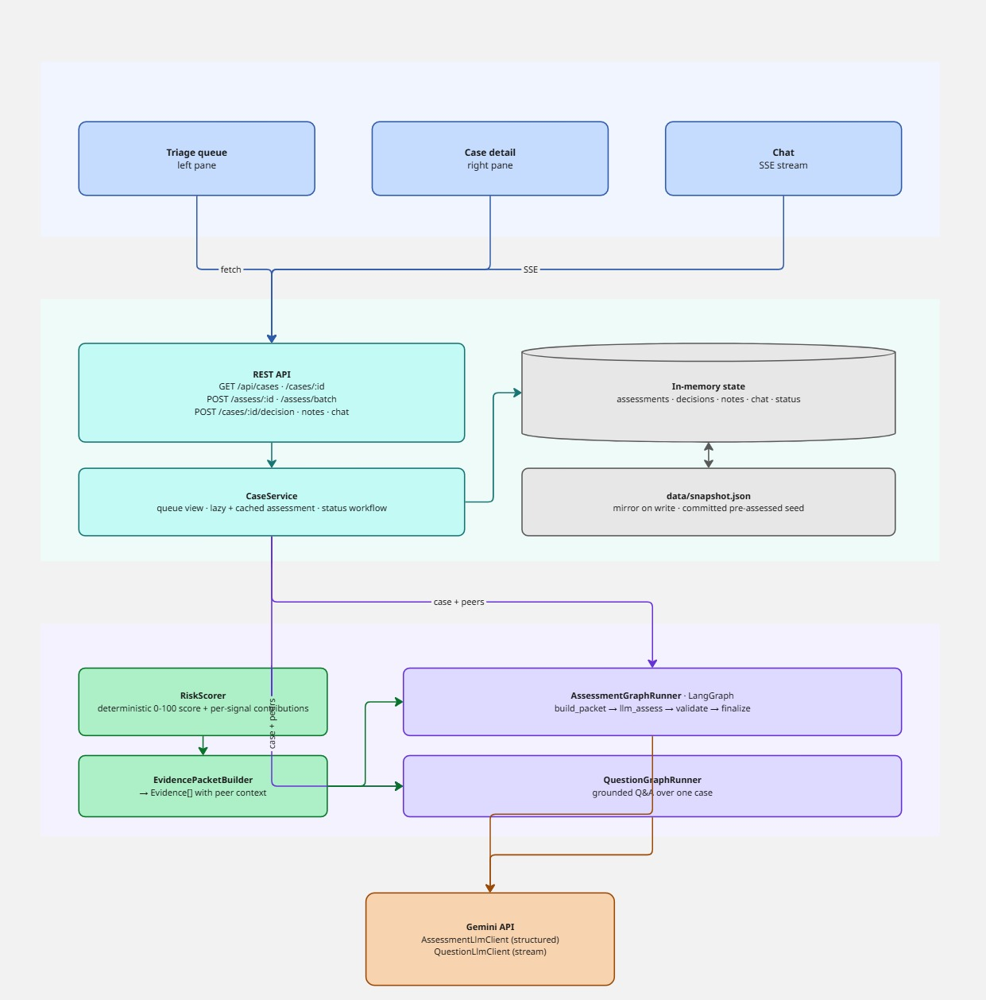
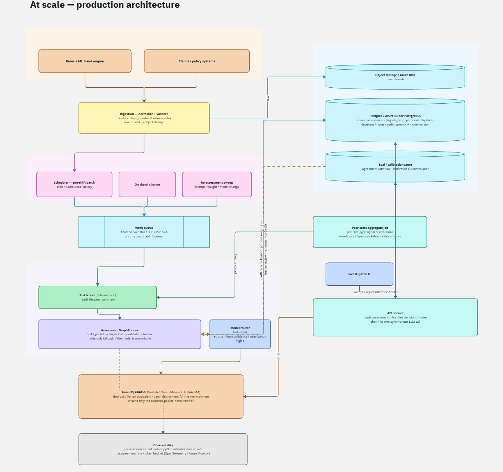

# Architecture

## Prototype (what runs in this repo)



Three layers, top to bottom: the **`investigator-web`** UI (blue), the **`investigator-be`**
FastAPI backend (teal), and the **`investigator-ai`** Python reasoning package (purple),
calling the **Gemini API** (orange).

**Key boundaries**

- The AI package is **stateless about the queue** — it holds no dataset. The backend owns
  ingestion and passes `case + peers` into the graph runners. Swapping the CSV for a real
  claims feed touches only `investigator-be`.
- `AiContainer` and the backend `Container` are the only places dependencies are constructed
  (composition roots). Everything else receives its collaborators by constructor injection.
- No database. In-memory state is the source of truth at runtime; `snapshot.json` is a flat
  mirror so a demo survives a restart, and a committed snapshot ships the queue pre-assessed.

## Per-case reasoning flow

```
case row + peer group (same care_type)
        │
        ▼
RiskScorer  ──────────────────────────────────  deterministic, no LLM, no randomness
  • percentile / z-score per numeric signal vs peers
  • binary rule flags at full weight
  • weighted sum → 0-100 score → band {Low, Medium, High}
        │
        ▼
EvidencePacketBuilder → Evidence[]  { id, label, raw_value, peer_context,
                                      direction, severity, weight, contribution }
  + non-scoring context (care_type, state, date)
  + data-quality flags (missing values; claim_number seen on >1 case)
        │
        ▼
AssessmentGraphRunner  (LangGraph state machine)
  build_packet → llm_assess → validate → (retry once | finalize)

  llm_assess : ONE schema-constrained Gemini call. Output =
               { summary, risk_level, confidence,
                 key_indicators:[{evidence_id, explanation}],
                 recommended_action, missing_info[] }
               The model may not emit figures — it cites evidence by id.

  validate   : deterministic critic —
               • drop any key_indicator citing an unknown evidence_id
               • require ≥1 surviving indicator
               • require risk_level within one band of the rule score
               → if violated and attempts < 2: retry with the error as feedback
               → else: keep, and note the disagreement (never hide it)

  finalize   : merge LLM judgement + full Evidence[]; if the LLM was unavailable or
               still invalid after retry → rules-only Assessment, llm_used=false,
               confidence=Low, clearly labelled.
        │
        ▼
Assessment  →  cached by hash(signal values)  →  served to the UI
```

## Target architecture (how this scales past 50 cases)

Not built — this is the design the prototype is a narrow slice of. Two constraints fix the
shape; everything else is a throughput problem:

- the assessment has to be **waiting when the investigator arrives** — an overnight batch,
  not a request/response service;
- long-term *care* claims are **PHI**, so member / provider data cannot leave a compliance
  boundary uncontrolled.

And the throughput isn't steady. Daily inflow is whatever the fraud engine forwards, but a
**prompt / weight / model change re-runs every open case** — a burst of hundreds of thousands
on demand. The pipeline is built to absorb bursts that dwarf the daily feed, which is why the
execution model is a queue with autoscaled workers, not a fixed pool.



**The decisions that actually matter**

- **Work queue → autoscaled stateless workers.** Each case is independent and the graph
  holds no cross-case state, so throughput is just worker count. One managed queue (Azure
  Service Bus, or SQS / Pub-Sub) absorbs the pre-shift batch, on-change re-assessment, and
  full backlog re-runs after a prompt change; priority tiers keep the nightly batch ahead of
  background sweeps. This is cheap to adopt up front on managed infra (queue + Azure Container
  Apps / Fargate / Cloud Run) and avoids a re-architecture later — so it's the design from day
  one, not a "later if needed".
- **The real ceiling is the LLM provider, not compute.** Workers are cheap; provider rate
  limits and per-token cost are not. At high volume: run the overnight batch through a **batch
  deployment** (Azure OpenAI Batch, or Bedrock / Vertex batch) — roughly half the price, and
  latency is fine because it's overnight — hold quota headroom for the interactive path, and
  apply **backpressure at the queue** when throttled instead of melting.
- **PHI stays inside a boundary.** Long-term *care* data is PHI, so the call goes to
  **Azure OpenAI in Manulife's own tenant** (covered by Microsoft's HIPAA BAA, prompts not
  used for training) — or, since the deterministic layer already turns raw values into "98th
  percentile vs peers", it carries only the evidence packet and never the raw member /
  provider record. This is the first thing an insurer's reviewer checks.
- **The assessments table is the cache.** Rows keyed by `hash(signal values)`; an unchanged
  case is never re-assessed. Partition by referral date once it's in the millions; the hash
  lookup stays O(1). No separate cache tier until UI read latency demands one.
- **Model routing is the main cost lever.** Strong model on low confidence, a near-band
  score, or a high dollar amount; everything else takes the fast model.
- **Peer stats are a batch aggregate, not per-worker.** A warehouse query / materialised view
  (Synapse / Fabric) computes the per-`care_type` signal distributions once per batch; workers
  read that small summary. Recomputing per case doesn't scale.
- **Batch and interactive are separate workloads.** Assessment workers are high-parallel and
  tolerate minutes of latency; the API / UI / chat service is synchronous, sub-second,
  low-volume, with its own LLM call for chat. They scale independently.
- **The feedback loop is offline and human-gated.** Investigator accept/reject gives an
  *agreement rate* (drift signal, regression set) — not ground truth. Confirmed fraud /
  confirmed-clean outcomes arrive weeks later; those are the real labels. A periodic job
  proposes new weights (or a learned but still interpretable model over the ~10 signals), a
  human reviews the change, it runs in shadow against the current one, then it's promoted.
  Every assessment records its prompt and model version so a regression can be rolled back.
- **Degrade, don't fail.** If the model is unavailable mid-batch, workers still finish with
  rules-only assessments (the prototype already does this per case) and the morning queue
  flags them.
- **Human review capacity is the outer limit.** Past a certain volume the constraint isn't
  the pipeline, it's investigator hours — which is why routing the *right* cases up (triage
  quality, confidence calibration) matters more at scale than raw throughput.

**Retrieval / vector store — deferred, not designed in.** An earlier draft put a `retrieve`
node in the assessment loop. It's cut from v1: no SOP corpus was provided; "prior dispositions
of similar cases" is a structured nearest-neighbour lookup over the signal vector, not RAG;
and SOP text is better surfaced in the UI next to the assessment than mixed into the grounded
prompt. It returns only with a real policy corpus *and* evidence it improves outcomes — at
which point the vector store is Azure AI Search (or pgvector on the Postgres already there).

**What changes vs the prototype**

| Concern | Prototype | Target |
|---|---|---|
| Ingestion | CSV at startup | normalising service; raw referrals → Blob Storage |
| State | in-memory + JSON snapshot | Azure Database for PostgreSQL + audit log |
| Assessment trigger | lazy on open / manual batch | pre-shift batch + on signal change + re-assessment sweeps |
| Throughput | sequential | Service Bus → autoscaled workers (Container Apps); ceiling is LLM-provider quota, not compute |
| Model spend | one model, all cases | routed: fast for bulk, strong for borderline / high-$; Batch deployment overnight |
| LLM environment | Gemini API directly | Azure OpenAI in-tenant (Microsoft HIPAA BAA), or evidence-packet-only calls |
| Peer stats | 50 rows in memory | per-`care_type` distributions materialised per batch (Synapse / Fabric) |
| Quality tracking | unit tests + validation notes | eval store: agreement rate now, confirmed outcomes later; offline recalibration with human review + shadow |
| Failure handling | per-case rules-only fallback | same, plus the batch completes and flags degraded cases |
